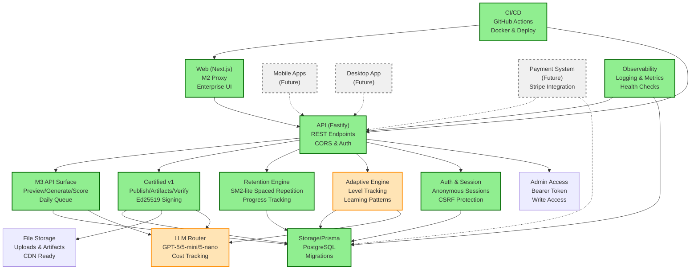

# Cerply Architecture

## System Overview

Cerply is built as a modern web application with a focus on adaptive learning, certified content, and enterprise-grade reliability.

## Architecture Diagram

## Component Mapping

### FSD Section ↔ Architecture Component ↔ SSOT IDs

| FSD Section | Architecture Component | SSOT IDs | Status |
|-------------|------------------------|----------|--------|
| §9 Certified v1 API | Certified v1 Pipeline | E-3, A-7, A-8 | ✅ Implemented |
| §12 Auth v0 | Auth & Session | L-3 | ✅ Implemented |
| §15 ER-MUI | Web (Next.js, M2 Proxy) | AU-1, AU-2, AU-3, L-1, L-2, B-1, B-4 | 🟡 In Progress |
| §22 M3 API Surface | M3 API Surface | L-1, L-2, L-6, L-7, L-8, L-11, L-12, L-15 | ✅ Implemented |
| §21.1 Retention v0 | Retention Engine (SM2-lite) | L-11 | ✅ Implemented |
| §21.2 Adaptive Planner | Adaptive Engine | L-9, L-14 | 🟡 In Progress |
| §21.3 LLM Router | LLM Router | All generation tasks | 🟡 In Progress |
| - | Storage/Prisma | All components | ✅ Implemented |
| - | CI/CD | All components | ✅ Implemented |
| - | Observability | All components | ✅ Implemented |

## Implementation Status

### ✅ Implemented Components
- **Web UI:** Next.js with M2 proxy, enterprise-ready design
- **API Layer:** Fastify with CORS, auth, and comprehensive endpoints
- **M3 API Surface:** Preview, generate, score, daily queue with 31/31 test assertions
- **Certified v1 Pipeline:** Ed25519 signing, artifacts, verification with admin controls
- **Retention Engine:** SM2-lite spaced repetition with progress tracking
- **Auth & Session:** Anonymous sessions with CSRF protection
- **Storage:** Prisma with PostgreSQL, migrations, and seed data
- **CI/CD:** GitHub Actions with Docker builds and automated deployment
- **Observability:** Health checks, logging, and usage metrics

### 🟡 In Progress Components
- **Adaptive Engine:** Basic level tracking implemented, full adaptive algorithms in progress
- **LLM Router:** Cost tracking implemented, full model routing in progress
- **Chat Interface:** Natural language input implemented, full conversational flow in progress

### ⏳ Planned Components
- **Mobile Apps:** iOS/Android for consumer and enterprise use
- **Desktop App:** Cross-platform app wrapper
- **Payment System:** Stripe integration with multi-currency support
- **Expert Workflow:** Complete expert onboarding and certification process
- **Business Dashboard:** Team management and analytics
- **Advanced Analytics:** Detailed learning patterns and insights

## Technology Stack

### Frontend
- **Framework:** Next.js 14 with App Router
- **Styling:** Tailwind CSS with brand tokens
- **Components:** React with TypeScript
- **Deployment:** Vercel with custom domains

### Backend
- **Runtime:** Node.js with TypeScript
- **Framework:** Fastify for high-performance API
- **Database:** PostgreSQL with Prisma ORM
- **Authentication:** Anonymous sessions with CSRF protection
- **File Storage:** CDN-ready artifact storage

### Infrastructure
- **Containerization:** Docker with multi-stage builds
- **CI/CD:** GitHub Actions with automated testing
- **Deployment:** Render (API) + Vercel (Web)
- **Monitoring:** Health checks and usage metrics
- **Security:** CORS, rate limiting, and security headers

## Data Flow

1. **User Input:** Web UI captures user input (text, files, URLs)
2. **API Processing:** Fastify API validates and routes requests
3. **Content Generation:** M3 API Surface processes content through LLM router
4. **Learning Flow:** Retention Engine schedules and tracks learning progress
5. **Certification:** Certified v1 Pipeline handles expert review and publishing
6. **Storage:** Prisma manages all data persistence with migrations
7. **Monitoring:** Observability tracks usage, costs, and system health

## Security Model

- **Authentication:** Anonymous sessions with secure cookies
- **Authorization:** Role-based access with admin bearer tokens
- **CSRF Protection:** Double-submit cookie pattern
- **CORS:** Configured for cross-origin requests
- **Rate Limiting:** Token-bucket algorithm for API protection
- **Content Signing:** Ed25519 signatures for certified artifacts
- **Data Privacy:** User data encrypted at rest and in transit

## Scalability Considerations

- **API Performance:** Fastify for high-throughput request handling
- **Database:** PostgreSQL with connection pooling and indexing
- **Caching:** CDN-ready artifacts with ETag headers
- **Monitoring:** Usage metrics and cost tracking for capacity planning
- **Deployment:** Containerized services for horizontal scaling

## Cross-References

- **Traceability Matrix:** [docs/specs/traceability-matrix.md](../specs/traceability-matrix.md)
- **Functional Spec:** [docs/functional-spec.md](../functional-spec.md)
- **SSOT:** [docs/specs/mvp-use-cases.md](../specs/mvp-use-cases.md)
- **BRD:** [docs/brd/cerply-brd.md](../brd/cerply-brd.md)

## Next Steps

1. **Complete Adaptive Engine:** Finish level tracking and learning pattern algorithms
2. **Implement Expert Workflow:** Build complete expert onboarding and certification process
3. **Add Business Features:** Team management, analytics, and assignment systems
4. **Payment Integration:** Stripe setup with subscription management
5. **Mobile Development:** iOS/Android apps for consumer and enterprise use
